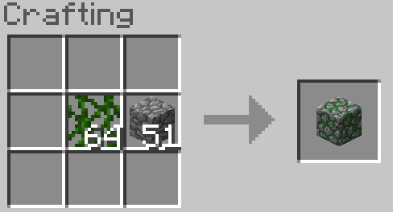
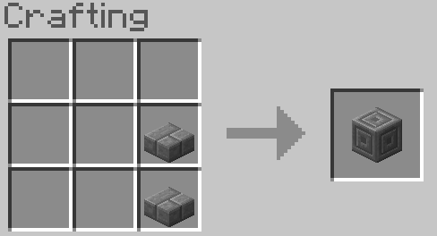
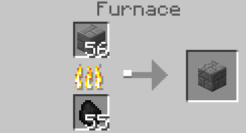

# Adds missing Minecraft 1.6.4 vanilla recipes

A Minecraft 1.6.4 legacy fabric mod that adds the ability to craft a few blocks that are generally available in the world but only craftable in later versions of the game.

## Moss Stone

## Mossy Stone Bricks

## Chiseled Stone Bricks

## Cracked Stone Bricks

